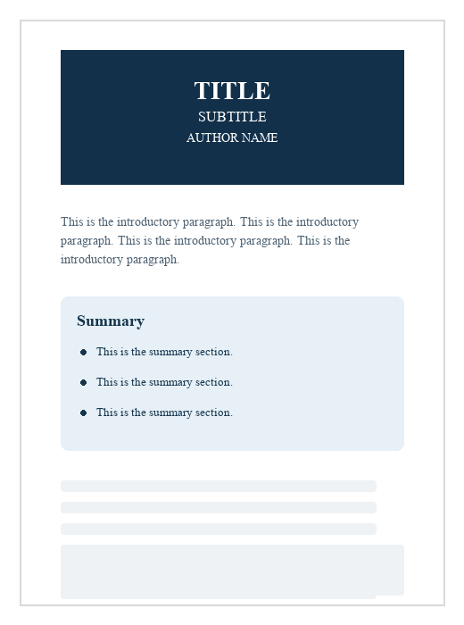

# PDF Report Template

A Quarto PDF template for academic research, publications, and reports.

This template controls the overall layout and aesthetics of the PDF report:

- a dark navy banner at the top of the first page
- a summary section, presented as bullet points 
- font, line spacing, and table/figure displays

## Preview



## Main File

- `quarto/pdf/header.tex`: the styling template for generating PDF reports

## Usage

This folder should contain only the *reusable* PDF layout files.
Actual write-up of the report, raw/processed data, python/r scripts, and outputs that are *specific* to the research project should be stored in its own project directory.

## Applying the Template

Clone the template repository once:

```bash
git clone https://github.com/quinnei/quarto-report-template.git ~/Documents/report-template
```

Inside the directory where the report `.qmd` file is stored, create a local `quarto/pdf` path and link the shared header file:

```bash
mkdir -p quarto/pdf
ln -s ~/Documents/report-template/quarto/pdf/header.tex quarto/pdf/header.tex
```

Make sure the report YAML includes:

```yaml
title: "INSERT TITLE HERE"
subtitle: "INSERT SUBTITLE HERE"
author: "INSERT AUTHOR NAME HERE"
format:
  pdf:
    include-in-header: quarto/pdf/header.tex
    fontsize: 12pt
    geometry:
      - top=1in
      - left=1in
      - right=1in
      - bottom=0.35in
      - includefoot
jupyter: python3  # optional
```

Then render the report from the folder that contains the `.qmd` file:

```bash
quarto render "Report Name.qmd" --to pdf
```
